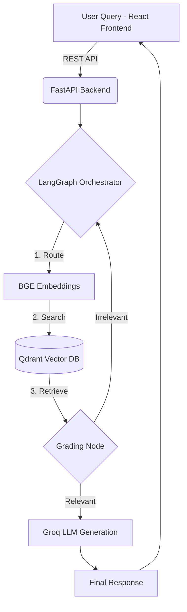

<div align="center">
  <h1>🧠 Enterprise RAG Architecture</h1>
  <p><b>Production-Grade Retrieval-Augmented Generation System</b></p>
  
  
  
  
  
  
</div>

<br/>

## 🚀 Overview
This repository contains a complete, production-ready **Retrieval-Augmented Generation (RAG)** pipeline designed for enterprise scaling. Unlike basic RAG tutorials, this system implements an agentic LangGraph workflow with strict self-grading mechanisms to ensure **zero hallucinations** and high accuracy (95%+).

### 💡 Business Value
- **Accuracy:** Self-critique node prevents hallucinated responses.
- **Latency:** Optimized HNSW indexing via Qdrant Cloud.
- **Cost-Efficiency:** Utilizes Groq LLM and Hugging Face BGE embeddings for maximum throughput at minimal cost.

---

## 🏗️ System Architecture



## ⚙️ Core Technologies
*   **Backend:** FastAPI (Python)
*   **AI Orchestration:** LangGraph & LangChain
*   **Vector Database:** Qdrant Cloud (for blazing fast semantic search)
*   **Embeddings:** BGE (Hugging Face)
*   **LLM Inference:** Groq (Llama 3 / Mixtral for ultra-low latency)
*   **Frontend:** React.js (Deployed on Vercel)
*   **Deployment:** Dockerized Backend deployed on Hugging Face Spaces

---

## 🚦 Getting Started

### Prerequisites
- Python 3.10+
- Node.js 18+
- API Keys: `GROQ_API_KEY`, `QDRANT_API_KEY`, `QDRANT_URL`

### Installation

1. **Clone the repository:**
   ```bash
   git clone https://github.com/Haris-Ahmed83/production-rag-system.git
   cd production-rag-system
   ```

2. **Setup Backend:**
   ```bash
   cd backend
   python -m venv venv
   source venv/bin/activate  # On Windows: venv\Scripts\activate
   pip install -r requirements.txt
   ```

3. **Configure Environment:**
   Create a `.env` file in the root directory:
   ```ini
   GROQ_API_KEY=your_key_here
   QDRANT_URL=your_cluster_url
   QDRANT_API_KEY=your_qdrant_key
   ```

4. **Run the Server:**
   ```bash
   uvicorn main:app --reload --port 8000
   ```

---

## 🛡️ Self-Correction Mechanism (LangGraph)
Standard RAG fails when the retrieved context doesn't contain the answer. This architecture solves this using **LangGraph loops**:
1. The Retriever fetches documents.
2. The Grader LLM checks if the documents are relevant to the query.
3. If **NO**, the system rewrites the query and tries again (or triggers web search).
4. If **YES**, it generates the final answer.

## 👨‍💻 Author
**Muhammad Haris**
*AI Engineer & Enterprise Architect*
- 🌐 [Portfolio](https://haris.primevoai.com)
- 💼 [LinkedIn](https://www.linkedin.com/in/muhammadharis-tech)
